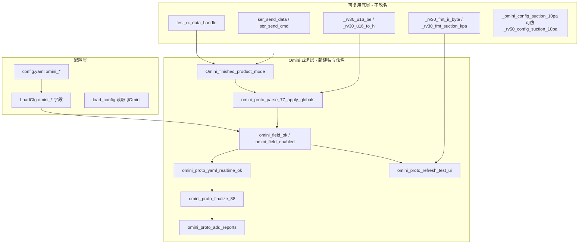

# Omini 基站全功能治具 — AI 实现规格（移交稿）

> **用途**：供后续 AI 或工程师在 **不依赖口头上下文** 的情况下，直接实现 Omini 基站全功能上位机逻辑。  
> **状态**：**未实现**（本文档为定稿规格；代码库中尚无 `omini_*` / `# #[OMINI-PROTO]`）。  
> **设计原则**：协议帧与 **RV50 全功能（017）** 相同；配置使用独立 **`omini_*` 前缀**；业务函数 **独立命名**（即使逻辑可复用 RV50，也写一套 `omini_proto_*`，并在判据层做优化）。  
> **对照范例**：`test_tool/test.py` 中 `# #[RV50-017-PROTO]`、`ui/MainFrame.py` 中 `rv50_item_result`、`config.yaml` §017、`doc/ce_mes_iteration/RV50_BASE_CONFIG_SCHEME_B_SPEC.md`（帧尾配置号扩展）。  
> **本文档不包含代码修改**；实现前必须先完成 §2「待用户确认项」。

---

## 1. 如何使用本文档（给 AI）

1. **全文搜索标记**：`# #[OMINI-PROTO]`、`OMINI-PROTO`、`omini_proto`、`Omini_finished_product_mode`。  
2. **禁止**自造帧格式/校验；组包/收包必须与现网一致（见 §4）：`test_rx_data_handle`、`ser_send_data`、`tool.check_sum`。  
3. **禁止**在 Omini 实现中直接调用 `rv50_proto_*` / `RV50_finished_product_mode`；可复用 **无业务前缀** 的底层工具（`_rv30_u16_be`、`_rv30_fmt_ir_byte`、`_rv30_kpa_to_10pa` 等）。  
4. **仅新增** Omini 工位相关逻辑；**不要**改动 `015`/`016`/`017`/`018`/`019`/`050` 等既有工位行为（除非用户明确要求统一修复 RV50 已知问题）。  
5. **实现前**：阅读 §2，向用户逐项确认；**未确认项按 §2.3 默认假设编码**，并在代码注释中标注 `OMINI-TBD`。  
6. 实现完成后：更新本文「修订记录」，并将常量与 §5 对齐。

---

## 2. 待用户确认项（实现前必须询问）

> **给 AI 的指令**：开始写代码前，用下面清单向用户提问；收到答复后写入本文 §2.4 或单独 changelog，再编码。

### 2.1 P0 — 不确认无法接线

| # | 问题 | 影响 |
|---|------|------|
| Q1 | **`device_type` 三位字符串**是多少？（如 `"01A"`、`"020"`） | `config.yaml`、`load_cfg.dev`、`barcode_check_process` 分支 |
| Q2 | **串口帧内 `dev` 字节**是多少？（017 为 `0x11`） | `test_cmd_handle` 分发、`ser_send_data(dev, ...)` |
| Q3 | **MES 工序站码**是什么？（017 为 `HNJZQGNCS`） | `mes/celink_mes.py` 新增映射 |
| Q4 | **`0x77` 数据区长度**：**38**（现网 017）还是 **39**（方案 B 帧尾 `base_config`）？ | `OMINI_77_DATA_LEN`、解析下标、UI 是否显示配置号 |
| Q5 | Omini 治具 **step 1~7 是否与 RV50 017 完全一致**？若不同，请提供 step→测试项对照表 | `omini_field_active(step, field)` |
| Q6 | **步骤四**包含哪些模块？（清水箱 / 尘袋 / 清洁底座 / 污水箱 / LED）缺哪些？ | `OMINI_STEP4_*`、`omini_step4_enabled_modules()` |
| Q7 | **过程阈值 NG** 是否发 **`0x89 [0x03]` + MES NG**？（当前 017 **会发**；旧 RV50 文档曾写「仅 UI 着色」） | `omini_proto_realtime_fail` 是否调用 |

### 2.2 P1 — 影响体验与报表

| # | 问题 | 影响 |
|---|------|------|
| Q8 | **未配置项 UI**：隐藏测试格，还是显示「不参与/N/A」？ | `MainFrame` 动态 `omini_item_result` |
| Q9 | **未配置项 MES**：不上报，还是 value-only（无 OK/NG）？ | `omini_proto_add_reports` |
| Q10 | 是否存在 **期望值为 0 但仍需比对** 的项？若存在，是否启用显式清单 `omini_modules:`？ | `omini_field_enabled` 判定规则 |
| Q11 | Omini 是否需要 **015 式配置号比对**（step=0 写配置）？还是像 017 一样 **仅显示** `base_config`？ | 015/016/017 分工或 Omini 单工位规则 |
| Q12 | 窗口标题 / 治具显示名（`heading_line_dict`）叫什么？ | UI 标题 |
| Q13 | 扫码门闸失败是否与 017 相同：`0x58` + `0x89 [0x03]`，**不上报 MES**？ | `barcode_check_process` |

### 2.3 默认假设（用户未答复时可暂用，须标 `OMINI-TBD`）

| 项 | 默认 |
|----|------|
| `device_type` | `"01A"`（占位） |
| 帧 `dev` 字节 | `0x1A`（26，占位；**必须与 Q2 一致**） |
| MES 站码 | `"HNOMINIGGNCS"`（占位，需 MES 侧确认） |
| `0x77` 长度 | **38**（与当前 `RV50_77_DATA_LEN` 一致；方案 B 39 字节待 Q4） |
| step 时间线 | 与 RV50 017 相同（见 §7） |
| 过程阈值 NG | **与现网 017 代码一致**：实时失败 → `0x89 [0x03]` + MES NG（step=4 除外，见 §8） |
| 未配置 = 通过 | 见 §6.2 |
| UI 未配置项 | **不创建测试格**（仅显示已启用项） |
| 扫码门闸 | 与 017 相同 |

### 2.4 用户确认记录（实现时填写）

| 项 | 用户答复 | 确认日期 |
|----|----------|----------|
| Q1 device_type | _待填_ | |
| Q2 帧 dev 字节 | _待填_ | |
| Q3 MES 站码 | _待填_ | |
| Q4 0x77 长度 | _待填_ | |
| Q5 step 对照 | _待填_ | |
| Q6 步骤四模块 | _待填_ | |
| Q7 实时 0x89 | _待填_ | |
| Q8~Q13 | _待填_ | |

---

## 3. 背景与架构选型

### 3.1 业务目标

- 兼容新型号基站 **Omini**，上位机协议与 **RV50 全功能（017）** 数据帧一致。  
- **功能模块动态可选**：`config.yaml` 配置了阈值/期望值则参与比对；**未配置则默认通过**（不参与 NG）。  
- 配置与代码 **与 RV50 隔离**：独立 `omini_*` 键、独立 `omini_proto_*` 函数名，避免 `device_type` 切换时串配置、便于多机型并行维护。

### 3.2 分层（实现时必须遵守）



### 3.3 相对 RV50 017 的优化点（Omini 新代码应直接采用）

| RV50 017 已知问题 | Omini 优化做法 |
|-------------------|----------------|
| 步骤四四模块 **硬编码**全检，与 yaml 跳过不一致 | `omini_step4_enabled_modules()` 仅含 **已配置** 的 `omini_*_expected` 模块 |
| 终判硬要求 `ver_res == "OK"`，与 `field_ok(dev_ver)` 跳过语义不一致 | 终判仅用 `omini_field_ok(p, "dev_ver")`：`False`→NG，`None`→跳过 |
| `rv50_field_ok` 大段 if-else | **字段注册表** `OMINI_FIELD_REGISTRY`（见 §6.3） |
| UI 固定 20 项 | 由 `omini_field_enabled` 过滤 `omini_item_result` |
| 配置键 `rv50_*` | 全部改为 `omini_*`，LoadCfg 独立字段 |

---

## 4. 公共帧格式（与现网 / RV50 017 一致）

### 4.1 接收（`test_rx_data_handle`）

1. 同步字：`0xA5`、`0x5A`。  
2. 第 3 字节 `pack_data_len`：**设备(1) + 命令(1) + 数据区(n)**；传入 `test_cmd_handle` 的 **`len(dat) = pack_data_len - 2`**。  
3. 末字节 SUM：从「长度字节」到「数据区末字节」累加 `% 256`。

### 4.2 发送（`ser_send_data` / `ser_send_cmd`）

- 短帧：`A5 5A 02 dev cmd sum`。  
- 有数据：第 3 字节 = **`0x02 + len(data)`**；后跟 `dev`、`cmd`、`data…`、`sum`。

### 4.3 命令字（与 017 相同）

| 方向 | 命令 | 含义 |
|------|------|------|
| 治具→PC | `0x66` | 开始测试（**不发** `0x67` 应答） |
| PC→治具 | `0x57` / `0x58` | 扫码通过 / 失败 |
| 治具→PC | `0x77` | 实时数据 |
| 治具→PC | `0x88` | 结束（`dat[0]`：`0x03` 正常 / `0x04` 基站通讯失败） |
| PC→治具 | `0x89` | 异常结束；实时 NG / 门闸失败发 `[0x03]` |
| 治具→PC | `0x68` | RV50 017 **忽略**；Omini 默认同样 **忽略**（除非用户另定） |

### 4.4 设备字节（Omini 待 Q2 确认）

| 配置项 | 目标值 | 模式函数 |
|--------|--------|----------|
| `device_type` = **Q1** | 帧内 **dev = Q2** | `Omini_finished_product_mode` |

---

## 5. `0x77` 数据区布局

### 5.1 长度常量

```python
# #[OMINI-PROTO]
# 默认 38（与现网 test.py RV50_77_DATA_LEN 一致）；Q4 确认为 39 时改为 39
OMINI_77_DATA_LEN = 38
# pack_data_len = 0x02 + OMINI_77_DATA_LEN + 2  → 38 字节时常见为 0x28(40) 需以治具实测为准
# 方案 B 39 字节时：末字节 dat[38] = base_config，见 RV50_BASE_CONFIG_SCHEME_B_SPEC.md §3.3
```

> **注意**：`RV50_017_AI_PROMPT_GUIDE.md` 部分旧稿写 36 字节；**以实现 `test.py` `RV50_77_DATA_LEN = 38` 及 `rv50_proto_parse_77_apply_globals` 为准**。Omini 与之对齐。

### 5.2 字节表（`dat[0..37]`，与 `rv50_proto_parse_77_apply_globals` 一致）

| 下标 | 解析字段名 | 宽度 | 说明 |
|------|------------|------|------|
| 0 | `step` | 1 B | 治具步骤 1~7（step4 为模块交互，见 §8） |
| 1~2 | `charge` | u16 BE | 充电电流 |
| 3 | `ir_l` | 1 B | 左回充码 |
| 4 | `ir_r` | 1 B | 右回充码 |
| 5 | `ir_n` | 1 B | 近卫回充码 |
| 6 | `clear_tank` | 1 B | 清水箱；step4 模块状态 0/1/2/3 |
| 7 | `duty_tank` | 1 B | 污水箱；step4 模块 |
| 8 | `dust` | 1 B | 尘袋；step4 模块 |
| 9 | `clean_base` | 1 B | 清洁底座；step4 模块 |
| 10~12 | `dev_ver` | 3 B | MCU 版本，`".".join(format(b,"03d") for b in dat[10:13])` |
| 13~15 | — | 3 B | 协议保留，**不解析** |
| 16~17 | `suction_10pa` | u16 BE | 集尘吸力，10Pa 计数；config 用 kPa |
| 18~19 | `clean_pump` | u16 BE | 清水泵电流 |
| 20~21 | `vacuum_pump` | u16 BE | 真空泵电流 |
| 22~23 | `base_level_up` | u16 BE | 底座液位(抬起) ADC |
| 24~25 | `base_level_down` | u16 BE | 底座液位(按下) ADC |
| 26~27 | `em_valve` | u16 BE | 电磁三通电流 |
| 28~29 | `wash_pump` | u16 BE | 清洁泵电流 |
| 30~31 | `turbidity` | u16 BE | 浊度 |
| 32~33 | `hot_start` | u16 BE | 热风开始 ADC（监视，通常不比阈值） |
| 34~35 | `hot_end` | u16 BE | 热风结束 ADC（监视） |
| 36~37 | `hot_diff` | u16 BE | 热风差值 ADC |
| **38** | `base_config` | 1 B | **仅当 OMINI_77_DATA_LEN==39**；016/017 方案 B |

### 5.3 解析函数（目标签名与返回值）

```python
def omini_proto_parse_77_apply_globals(dat):
    """#[OMINI-PROTO] 解析 0x77，写入全局展示变量，返回 dict p。"""
    if len(dat) < OMINI_77_DATA_LEN:
        print("[OMINI] 0x77 数据区长度不足: got", len(dat), "need", OMINI_77_DATA_LEN)
        return None
    # ... 按上表解析，逻辑同 rv50_proto_parse_77_apply_globals ...
    # ver_res：仅当 load_cfg.mcu_ver 非空时比对 dev_ver
    return {
        "step": step,
        "charge": charge_value,
        "ir_l": ir_code_left,
        # ... 其余字段 ...
        # "base_config": int(dat[38]) & 0xFF,  # 仅 39 字节时
    }
```

---

## 6. 配置与判据引擎

### 6.1 config.yaml §Omini（目标片段）

```yaml
# -----------------------------------------------------------------------------
# §Omini  device_type=<Q1>  Omini 基站全功能测试
# #[OMINI-PROTO] 0x77 数据区长度见 OMINI_77_DATA_LEN；某项未配置或 min/max/期望全 0 → 不参与比较（默认 PASS）
# -----------------------------------------------------------------------------

# 可选显式模块清单（Q10）；不配则完全由下方 omini_* 键推断
# omini_modules:
#   - charge
#   - ir_l
#   - ir_r
#   - ir_n
#   - suction_10pa
#   - clear_tank   # 步骤四 + 期望值

omini_charge_min: 200
omini_charge_max: 3000

omini_ir_l: 0x44
omini_ir_r: 0x42
omini_ir_n: 0x48

omini_clear_tank_expected: 0x03    # 不配 → 跳过步骤四清水箱 + 终判
# omini_duty_tank_expected: 0x03
# omini_dust_expected: 0x03
# omini_clean_base_expected: 0x03

omini_suction_kpa_min: 17          # kPa；内部转 10Pa 计数
omini_suction_kpa_max: 30

# omini_clean_pump_min / omini_clean_pump_max
# omini_vacuum_pump_min / omini_vacuum_pump_max
# omini_base_level_up_min / omini_base_level_up_max
# omini_base_level_down_min / omini_base_level_down_max
# omini_em_valve_min / omini_em_valve_max
# omini_wash_pump_min / omini_wash_pump_max
# omini_turbidity_min / omini_turbidity_max
# omini_hot_diff_min / omini_hot_diff_max

# 方案 B 配置号（Q4/Q11）
# omini_base_config_expected: 0x23   # 仅当产品要求 step=0 比对；0=不参与
```

在 **device_type 索引注释**中增加一行（实现时）：

```yaml
#   <Q1>  Omini 基站全功能测试  → §Omini（帧 dev=<Q2>）；0x88：03 正常 / 04 基站通讯失败
```

### 6.2 「未配置 = 通过」规则（权威）

| 判据类型 | config 键 | **enabled（参与比对）** 条件 | `omini_field_ok` 返回值 |
|----------|-----------|------------------------------|-------------------------|
| 版本 | `mcu_version`（公共） | 非空字符串 | 相等 True；不等 False；空 None |
| 区间 | `omini_{field}_min/max` | **两键均存在且不全为 0** | 区间内 True；外 False；否则 None |
| 集尘 kPa | `omini_suction_kpa_min/max` | 同上（转 10Pa） | 同上 |
| 期望值 | `omini_{name}_expected` | **值非 0** | 相等 True；不等 False；否则 None |
| 步骤四模块 | `omini_clear_tank_expected` 等 | 对应 expected **非 0** | step4：v==3 True；否则按 step4 UI；**未 enabled 则终判跳过（视为通过）** |
| 热风 start/end | — | **永不 enabled** | 始终 None（监视） |
| 尘袋 step4 字段 `dust` | `omini_dust_expected` | 非 0 | step4 模块逻辑；yaml 实时字段列表可 skip `dust`（同 RV50） |

**汇总语义**（与 RV30/RV50 一致）：

- `omini_field_ok` → `True` / `False` / `None`（None = 跳过，**不算 NG**）。  
- `omini_proto_yaml_realtime_ok` / `omini_proto_yaml_all_items_ok`：**仅当 `ok is False` 才 NG**。

### 6.3 字段注册表（推荐实现，减少 if-else）

```python
# #[OMINI-PROTO] 每项：field, kind, min_key, max_key, expected_key, active_from_step
# kind: "range" | "expected" | "version" | "monitor"
OMINI_FIELD_REGISTRY = [
    {"field": "dev_ver",      "kind": "version",  "active_from_step": 4},
    {"field": "charge",       "kind": "range",    "min_key": "omini_charge_min",       "max_key": "omini_charge_max",       "active_from_step": 1},
    {"field": "ir_l",         "kind": "expected", "expected_key": "omini_ir_l",         "active_from_step": 3},
    {"field": "ir_r",         "kind": "expected", "expected_key": "omini_ir_r",         "active_from_step": 3},
    {"field": "ir_n",         "kind": "expected", "expected_key": "omini_ir_n",         "active_from_step": 3},
    {"field": "clear_tank",   "kind": "expected", "expected_key": "omini_clear_tank_expected",   "active_from_step": 4, "step4_module": True},
    {"field": "duty_tank",    "kind": "expected", "expected_key": "omini_duty_tank_expected",    "active_from_step": 4, "step4_module": True},
    {"field": "dust",         "kind": "expected", "expected_key": "omini_dust_expected",         "active_from_step": 4, "step4_module": True},
    {"field": "clean_base",   "kind": "expected", "expected_key": "omini_clean_base_expected",   "active_from_step": 4, "step4_module": True},
    {"field": "suction_10pa", "kind": "range",    "min_key": "omini_suction_kpa_min",    "max_key": "omini_suction_kpa_max",    "active_from_step": 5, "suction_kpa": True},
    {"field": "clean_pump",   "kind": "range",    "min_key": "omini_clean_pump_min",     "max_key": "omini_clean_pump_max",     "active_from_step": 6},
    {"field": "vacuum_pump",  "kind": "range",    "min_key": "omini_vacuum_pump_min",    "max_key": "omini_vacuum_pump_max",    "active_from_step": 6},
    {"field": "base_level_up",   "kind": "range", "min_key": "omini_base_level_up_min",   "max_key": "omini_base_level_up_max",   "active_from_step": 6},
    {"field": "base_level_down", "kind": "range", "min_key": "omini_base_level_down_min", "max_key": "omini_base_level_down_max", "active_from_step": 6},
    {"field": "em_valve",     "kind": "range",    "min_key": "omini_em_valve_min",       "max_key": "omini_em_valve_max",       "active_from_step": 6},
    {"field": "wash_pump",    "kind": "range",    "min_key": "omini_wash_pump_min",      "max_key": "omini_wash_pump_max",      "active_from_step": 7},
    {"field": "turbidity",    "kind": "range",    "min_key": "omini_turbidity_min",      "max_key": "omini_turbidity_max",      "active_from_step": 7},
    {"field": "hot_diff",     "kind": "range",    "min_key": "omini_hot_diff_min",       "max_key": "omini_hot_diff_max",       "active_from_step": 7},
    {"field": "hot_start",    "kind": "monitor",  "active_from_step": 7},
    {"field": "hot_end",      "kind": "monitor",  "active_from_step": 7},
]
```

辅助函数（目标）：

```python
def omini_field_enabled(field) -> bool: ...
def omini_field_active(step, field) -> bool: ...   # step >= active_from_step 且 enabled
def omini_field_ok(p, field): ...                # True/False/None
def omini_step4_enabled_modules() -> tuple: ...  # registry 中 step4_module 且 enabled
```

### 6.4 LoadCfg 新增字段（`test_tool/test.py` `LoadCfg`）

与 `config.yaml` 键一一对应，**全部 `omini_*` 前缀**，默认值 **0**（表示不参与）。充电/集尘可仿 RV50 存 H/L 四字节或仅存 min/max——**实现时二选一并在 load_config 统一转换**。

必含：

- `omini_charge_min/max` 或 `omini_charge_Hmin/Lmin/Hmax/Lmax`  
- `omini_suction_10pa_*` 或 kPa 源键  
- `omini_ir_l/r/n`  
- `omini_clear_tank_expected`、`omini_duty_tank_expected`、`omini_dust_expected`、`omini_clean_base_expected`  
- 各泵/液位/浊度/热风 `omini_*_min/max`  
- 可选 `omini_base_config_expected`  
- 可选 `omini_modules: list`（若 Q10 启用）

---

## 7. 治具步骤与 `omini_field_active`

**默认与 RV50 017 相同**（`rv50_field_active`，待 Q5 确认）：

| step | 开放字段（enabled 时才判） |
|------|---------------------------|
| ≥1 | `charge` |
| ≥3 | `ir_l`, `ir_r`, `ir_n` |
| ≥4 | 步骤四模块 + `dev_ver` |
| ≥5 | `suction_10pa` |
| ≥6 | `clean_pump`, `vacuum_pump`, `base_level_up`, `base_level_down`, `em_valve` |
| ≥7 | `wash_pump`, `turbidity`, `hot_diff`；`hot_start`/`hot_end` 仅监视 |

**实时判据**：`step == 4` 时 **不** 走 yaml 区间/期望 NG（与 017 相同，步骤四走模块子状态 UI + 工人操作提示）。

---

## 8. 步骤四（模块交互）

### 8.1 模块顺序（默认同 RV50）

```python
OMINI_STEP4_MODULE_FIELDS = ("clear_tank", "dust", "clean_base", "duty_tank")  # 顺序固定
OMINI_STEP4_SUBSTEPS = (
    ("clear_tank", "清水箱", "请提起清水箱", "请放下清水箱", "提起/放下清水箱，直到「清水箱在位」通过"),
    ("dust", "尘袋", "请拔出尘袋", "请插入尘袋", "拔插尘袋，直到「尘袋」通过"),
    ("clean_base", "清洁底座", "请取出清洁底座", "请放入清洁底座", "取出/放入清洁底座，直至「清洁底座在位」通过"),
    ("duty_tank", "污水箱", "请提起污水箱", "请放下污水箱", "提起/放下污水箱，直至「污水箱在位」通过"),
)
OMINI_STEP4_ORDER_HINT = "步骤四：请严格按顺序操作（清水箱→尘袋→清洁底座→污水箱→观察灯显）"
OMINI_STEP4_LED_HINT = "请工人观察LED灯显示，正常按开始键，异常按结束键"
```

### 8.2 优化：`omini_step4_flow_complete`

```python
def omini_step4_flow_complete():
    """仅检查 omini_step4_enabled_modules() 中各项 int(p[f])==3。"""
    # 若 omini_max_step < 4：return True
    # 若 enabled 列表为空：return True（Omini 无步骤四模块）
```

终判 `omini_proto_yaml_all_items_ok` 中步骤四循环 **同样只检查 enabled 模块**。

---

## 9. 会话状态机与全局变量

### 9.1 状态常量

```python
OMINI_SESS_IDLE = 0
OMINI_SESS_WAIT_SN = 1
OMINI_SESS_RUNNING = 2
OMINI_SESS_FINISHED = 3
OMINI_SESS_ABORTED = 4
```

### 9.2 全局变量（命名独立，勿与 `rv50_*` 共用）

| 变量 | 用途 |
|------|------|
| `omini_session_state` | 会话状态 |
| `omini_last_p` | 最近一帧 0x77 解析 dict；**0x88/03 终判唯一数据源** |
| `omini_max_step` | 本轮最大 step |
| `omini_last_step` | 上一帧 step（通知防抖） |
| `omini_last_step4_notify_key` | 步骤四通知防抖 |
| `omini_89_mes_done` | MES 是否已上报（防重复） |
| `omini_realtime_ng` | 实时 NG 标记 |

---

## 10. 主流程 `Omini_finished_product_mode(dev, cmd, dat)`

**语义对照**：`RV50_finished_product_mode`（`test_tool/test.py` 约 2437 行起）。

| cmd | 行为 |
|-----|------|
| `0x66` `dat[0]==0x00` | 清 MES、`reset_ui`、状态→`WAIT_SN`、提示「请扫码」 |
| `0x77` | 状态须 `RUNNING`；`omini_proto_parse_77_apply_globals`；更新 `omini_last_p`/`omini_max_step`；刷新 UI；**若 Q7 确认**：`not omini_proto_yaml_realtime_ok(p)` → `omini_proto_realtime_fail` |
| `0x88` | `omini_proto_finalize_88` |
| `0x68` | 打印忽略（默认） |

### 10.1 扫码门闸（`barcode_check_process` 新增分支）

**对照**：`int(load_cfg.dev) == 17` 分支（约 604 行）。

- 编码规则失败 / MES 失败：`0x58` + `0x89 [0x03]`，**不上报 MES**，`omini_session_state = ABORTED`。  
- 成功：`0x57`，`RUNNING`，重置 step 缓存。

`ser_send_data` 的 **dev 参数使用帧 dev 字节 Q2**（与 `load_cfg.dev` 数值可能不同，需与 017 一样按实际帧 dev 发送）。

### 10.2 终判 `omini_proto_finalize_88`

| `dat[0]` | 行为 |
|----------|------|
| `0x04` | MES 单项「基站通讯」NG；不回 0x89 |
| `0x03` | 综合判定（**不要**单独硬编码 `ver_res==OK`） |

```python
mes_ok = (
    p is not None
    and not omini_realtime_ng
    and omini_proto_yaml_finalize_ok(p)
    and omini_step4_flow_complete()
)
# dev_ver：在 omini_proto_yaml_all_items_ok 内通过 omini_field_ok("dev_ver") 处理
```

---

## 11. UI（`ui/MainFrame.py`）

### 11.1 测试格定义

新建 **`omini_item_result`**（结构同 `rv50_item_result`），键名建议加 `omini_` 前缀避免与 RV50 控件冲突，例如：

| UI 键名 | 字段 | 显示名 |
|---------|------|--------|
| `mcu_ver` | `dev_ver` | MCU版本 |
| `charge_value` | `charge` | 充电电流 |
| `omini_hot_start` | `hot_start` | 热风开始 |
| `ir_code_left` | `ir_l` | 左回充码 |
| … | … | … |

### 11.2 动态测试格（Q8 默认：仅 enabled 项）

- `load_config` 后或 `MainFrame` 初始化时调用 `omini_build_item_result()` → 过滤 registry。  
- `int(load_cfg.dev) == <Q1>` 时使用 `omini_item_result`。  
- `test_static_box` 显示条件增加 Omini device_type。

### 11.3 UI 着色

- `omini_proto_apply_test_ui_row`：对照 `rv50_proto_apply_test_ui_row`（pass/fail/monitor/untested）。  
- 步骤四模块：对照 `rv50_module_step4_ui` / `omini_module_step4_ui`。

---

## 12. MES

### 12.1 站码映射（`mes/celink_mes.py`）

```python
"<Q1>": "<Q3>",  # 例："01A": "HNOMINIGGNCS"
```

### 12.2 上报（`omini_proto_add_reports`）

- **enabled** 项：写入 result / val_min / val_max（对照 `rv50_proto_add_reports`）。  
- **未 enabled** 项：按 Q9 默认 **不上报**（或仅 value，实现时注释说明）。  
- 实时 NG：`omini_proto_realtime_fail` → `add_report("Omini实时判据", NG)` + `send_report` NG（一次）。

---

## 13. 代码锚点与文件改动清单

### 13.1 新建 / 修改文件

| 文件 | 改动 |
|------|------|
| `test_tool/test.py` | `# #[OMINI-PROTO]` 常量、`LoadCfg`、`load_config()`、`test_cmd_handle`、`barcode_check_process`、`Omini_finished_product_mode`、`omini_proto_*` 全套 |
| `ui/MainFrame.py` | `omini_item_result`、`heading_line_dict`、测试格分支、显示条件 |
| `config.yaml` | §Omini + device_type 索引注释 |
| `mes/celink_mes.py` | MES 站码 |
| 可选 `test_tool/omini_proto.py` | 若单文件过大，可将 Omini 逻辑拆出并由 `test.py` import |

### 13.2 建议函数清单（实现时逐项落地）

```
# 常量与会话
OMINI_77_DATA_LEN, OMINI_SESS_*, OMINI_STEP4_*, OMINI_FIELD_REGISTRY
omini_proto_reset_to_idle()

# 配置
_omini_config_suction_10pa(config)
_omini_suction_threshold_10pa()
omini_field_enabled(field)
omini_field_active(step, field)
omini_field_ok(p, field)
omini_field_status(p, field)
omini_field_status_finalize(p, field)
omini_step4_enabled_modules()
omini_step4_monitor_phase(p)
omini_step4_flow_complete()
omini_module_step4_ui(p, field)
omini_step4_notify(p)

# 协议
omini_proto_parse_77_apply_globals(dat)
omini_proto_yaml_realtime_ok(p)
omini_proto_yaml_all_items_ok(p)
omini_proto_yaml_finalize_ok(p)
omini_proto_realtime_fail(dev, reason)
omini_proto_mes_ng_once(notify_second)
omini_proto_finalize_88(dev, dat)
Omini_finished_product_mode(dev, cmd, dat)

# UI / MES
_omini_proto_ui_rows(p)
omini_proto_apply_test_ui_row(...)
omini_proto_refresh_test_ui(p, finalize=False)
omini_proto_add_reports()
omini_build_item_result()   # 可选，供 MainFrame
```

### 13.3 可复用但不改名的符号（直接 import/调用）

- `ser_send_data`, `ser_send_cmd`, `tool.check_sum`  
- `_rv30_u16_be`, `_rv30_u16_to_hl`, `_rv30_config_u16`, `_rv30_kpa_to_10pa`, `_rv30_10pa_to_kpa`  
- `_rv30_fmt_ir_byte`, `_rv30_fmt_suction_kpa`  
- `mes_run.*`, `wx.CallAfter`, `MainFrame.main_frame.up_test_ui`

---

## 14. 实现顺序建议

1. 向用户确认 §2 P0/P1，填写 §2.4。  
2. `LoadCfg` + `load_config()` 读取 `omini_*`。  
3. `omini_field_enabled` / `omini_field_ok` + 单元测试式自测（可选）。  
4. `omini_proto_parse_77_apply_globals`。  
5. `Omini_finished_product_mode` + `test_cmd_handle` + 扫码分支。  
6. UI：`omini_item_result` + 刷新逻辑。  
7. MES 站码 + `omini_proto_add_reports` + 终判。  
8. 联调：仅配置 2~3 项，验证未配置项 PASS。  
9. 若 Q4=39：追加 `base_config` 解析与 UI（比对规则见 Q11）。

---

## 15. 测试计划（联调检查表）

- [ ] `device_type=<Q1>` 启动，标题与测试格正确。  
- [ ] 仅配置 `omini_charge_*`：其它项终判 PASS，充电超界实时 NG（若 Q7=是）。  
- [ ] 未配置步骤四 expected：无步骤四 NG，`omini_step4_flow_complete` 为 True。  
- [ ] 配置步骤四某一模块：仅该模块要求 v==3。  
- [ ] `mcu_version` 空：版本不参与终判。  
- [ ] `0x88/0x04`：基站通讯失败 MES NG。  
- [ ] 扫码失败：0x58+0x89，不上报 MES。  
- [ ] 与 RV50 017 同机切换 `device_type`：互不影响阈值（`omini_*` vs `rv50_*` 隔离）。

---

## 16. 修订记录

| 日期 | 说明 |
|------|------|
| 2026-06-09 | 初稿：Omini 独立 `omini_*` 配置 + 独立函数命名 + 字段注册表优化；含待确认项清单；**未改代码** |
