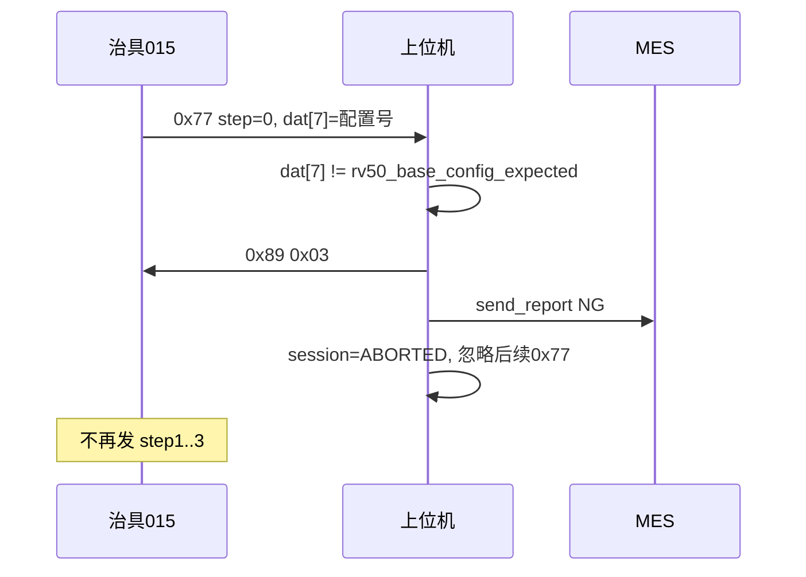

# RV50 基站配置号（方案 B）— 协议与实现规格

> **用途**：供后续 AI 或工程师在 **不依赖口头上下文** 的情况下，直接实现「RV50 过气 / 过水 / 全功能」三工位 `0x77` 数据区扩展（帧尾追加 1 字节基站配置号）及 UI/MES/异常收尾。  
> **状态**：**未实现**（本文档为定稿规格；代码仍使用扩展前长度 7 / 16 / 38 字节）。  
> **方案选定**：**方案 B — 配置字节追加在数据区最后一字节**（原有字段下标 **不变**）。  
> **协议参考**：`doc/基站写配置.csv`（其中短帧 `05/00/23` 为早期草案，**以实现本文为准**）。  
> **代码锚点（实现后）**：`test_tool/rv50_base_config.py`（新建）、`test_tool/test.py`（`# #[RV50-BASE-CONFIG-B]`）、`ui/MainFrame.py`、`config.yaml` §015。

---

## 如何使用本文档（给 AI）

1. **全文搜索标记**：`# #[RV50-BASE-CONFIG-B]`、`RV50-BASE-CONFIG-B`、`rv50_base_config`。  
2. **禁止**自造帧格式/校验；组包/收包必须与 `test_rx_data_handle`、`ser_send_data` 一致（见 §2）。  
3. **仅改** `device_type` 为 `015` / `016` / `017` 相关逻辑；**不要**改 `050`（RV30）、`019`（气密）等工位。  
4. **015 比对、016/017 仅显示** — 业务分工见 §4，不可混用。  
5. 实现完成后更新本文「修订记录」，并将 `RV50AIR_77_DATA_LEN` 等常量与 §3 对齐。  
6. 对照范例：[`RV50_017_AI_PROMPT_GUIDE.md`](./RV50_017_AI_PROMPT_GUIDE.md)、[`RV30_BASESTATION_PROTOCOL_AND_IMPLEMENTATION_SPEC.md`](./RV30_BASESTATION_PROTOCOL_AND_IMPLEMENTATION_SPEC.md)。

---

## 1. 背景与方案 B 选型

### 1.1 业务需求

- 流水线在 **某一工位**（已定：**015 过气负责写配置与比对**）读取治具上报的 **基站配置号**（8 bit，UI 显示为两个十六进制位，如 `0x23`）。
- **016 过水、017 全功能** 同样收到扩展后的 `0x77`，在 UI **显示**配置号，**不做阈值/期望值比对**，**不因配置 NG**。
- **step=0** 表示「基站写配置」阶段；之后 **step≥1** 继续原有测试项（前缀模式，非独立短帧）。
- **015 step=0 配置不匹配**：与其它工位实时 NG 一样 — 上位机发 **`0x89 [0x03]`**、MES NG、会话 ABORT；治具不再发后续 step；上位机 **忽略** 后续 `0x77`/`0x88`。

### 1.2 方案 A vs 方案 B（已定 B）

| | 方案 A：step 后插入，后续字段整体 +1 | **方案 B：帧尾追加 1 字节（已定）** |
|--|--|--|
| 015 气压字段 | `dat[1..6]` 全部后移 | **`dat[1..6]` 不变**，`dat[7]`=配置 |
| 016 水量/温度 | `dat[1..15]` 后移 | **`dat[1..15]` 不变**，`dat[16]`=配置 |
| 017 全功能 | 版本/集尘等 **大量下标后移**，含 `dat[13..15]` 空洞 | **原 38 字节下标不动**，`dat[38]`=配置 |
| 代码改动 | 三处 parser 全改偏移 | 长度 +1、末字节解析、UI/MES/015 比对 |

**实现时必须采用方案 B。**

---

## 2. 公共帧格式（与现网一致）

### 2.1 接收（`test_rx_data_handle`）

1. 同步字：`0xA5`、`0x5A`。  
2. 第 3 字节 `pack_data_len`：**设备(1) + 命令(1) + 数据区(n)**，故传入 `test_cmd_handle` 的 **`len(dat) = pack_data_len - 2`**。  
3. 末字节 SUM：从「长度字节」到「数据区末字节」累加 `% 256`。

### 2.2 发送（`ser_send_data` / `ser_send_cmd`）

- 短帧：`A5 5A 02 dev cmd sum`。  
- 有数据：第 3 字节 = **`0x02 + len(data)`**；后跟 `dev`、`cmd`、`data…`、`sum`（`tool.check_sum`）。

### 2.3 命令字（三工位共有）

| 方向 | 命令 | 含义 |
|------|------|------|
| 治具→PC | `0x66` | 开始测试（不发 `0x67` 应答） |
| PC→治具 | `0x57` / `0x58` | 扫码通过 / 失败 |
| 治具→PC | `0x77` | 实时数据（扩展后见 §3） |
| 治具→PC | `0x88` | 结束（`dat[0]`：`03` 正常 / `04` 基站通讯失败） |
| PC→治具 | `0x89` | 异常结束；**015 配置 NG** 时发 `[0x03]`（见 §6） |

### 2.4 设备字节

| device_type | 帧内 dev | 模式函数 |
|-------------|----------|----------|
| `015` | `0x0F` (15) | `RV50_air_mode` |
| `016` | `0x10` (16) | `RV50_water_mode` |
| `017` | `0x11` (17) | `RV50_finished_product_mode` |

---

## 3. 扩展后 `0x77` 数据区布局（方案 B）

**统一规则**：在 **原数据区末尾** 增加 1 字节 `base_config`（8 bit 无符号）。  
**解析常量名（目标）**：

| 工位 | 原长度 | **新长度** | 帧长字段 `pack_data_len` | 配置字节下标 |
|------|--------|------------|---------------------------|--------------|
| 015 过气 | 7 | **8** | **`0x0A`** (10) | **`dat[7]`** |
| 016 过水 | 16 | **17** | **`0x13`** (19) | **`dat[16]`** |
| 017 全功能 | 38 | **39** | **`0x29`** (41) | **`dat[38]`** |

**代码常量（实现时替换）**：

```python
# #[RV50-BASE-CONFIG-B]
RV50AIR_77_DATA_LEN = 8      # 原硬编码 7 / 无命名常量
RV50WATER_77_DATA_LEN = 17     # 原 16
RV50_77_DATA_LEN = 39          # 原 38
```

---

### 3.1 015 过气 — 8 字节

| 下标 | 字段名 | 宽度 | 单位/说明 |
|------|--------|------|-----------|
| 0 | `step` | 1 B | `0`=写配置；`1`=进入产测；`2`=测试中；`3`=结果上传 |
| 1~2 | 清水通路气压 | u16 BE | 10Pa 计数 → UI kPa（`×0.01`） |
| 3~4 | 拖布通路气压 | u16 BE | 同上 |
| 5~6 | 污水通路气压 | **int16** BE | 同上（现有代码用 `wsxqmx_bytes_to_int16`） |
| **7** | **`base_config`** | **1 B** | **基站配置号（新增）** |

**解析伪代码（在现有 `rv50air_parse_77` 末尾追加）**：

```python
"base_config": int(dat[7]) & 0xFF,
```

**step=0 时**：配置号以 `dat[7]` 为准；气压字段 `dat[1..6]` 可能为 0 或无效 — **015 在 step=0 仅判配置，不判气压**。

---

### 3.2 016 过水 — 17 字节

| 下标 | 字段名 | 宽度 | 说明 |
|------|--------|------|------|
| 0 | `step` | 1 B | 工步（现有逻辑：step3 终判等） |
| 1~2 | `clear_water_volume` | u16 BE | 清水水量 |
| 3~4 | `duty_water_volume` | u16 BE | 污水水量 |
| 5~6 | `left_mop_water_volume` | u16 BE | 左拖布水量 |
| 7~8 | `right_mop_water_volume` | u16 BE | 右拖布水量 |
| 9~10 | `left_mop_temperature` | u16 BE | 左拖布温度 ADC |
| 11~12 | `right_mop_temperature` | u16 BE | 右拖布温度 ADC |
| 13 | `cleaner_liquid_level` | 1 B | 清洁剂液位 |
| 14~15 | `base_hot_water_temp` | u16 BE | 基站热水温度 ADC |
| **16** | **`base_config`** | **1 B** | **新增** |

**解析伪代码**：

```python
"base_config": int(dat[16]) & 0xFF,
```

---

### 3.3 017 全功能 — 39 字节

**原 `rv50_proto_parse_77_apply_globals` 中 `dat[0..37]` 下标保持不变**，仅在 return dict 中增加：

```python
"base_config": int(dat[38]) & 0xFF,
```

| 下标 | 字段 | 说明 |
|------|------|------|
| 0 | step | 1~7 现有分步逻辑 |
| 1~2 | 充电电流 | u16 BE |
| 3~5 | 左/右/近卫回充码 | 各 1 B |
| 6~9 | 清水箱/污水箱/尘袋/清洁底座 | 各 1 B |
| 10~12 | MCU 版本 | 3× `NNN` 拼 `dev_ver` |
| 13~15 | （协议保留，现网未解析业务字段） | 保持跳读 |
| 16~17 | 集尘吸力 | u16 BE，10Pa |
| 18~37 | 泵电流、液位、浊度、热风等 | 与现网一致 |
| **38** | **`base_config`** | **新增** |

---

## 4. 业务规则矩阵

| 规则 | 015 过气 | 016 过水 | 017 全功能 |
|------|----------|----------|------------|
| 收到扩展 `0x77` | 是 | 是 | 是 |
| UI 显示「基站配置号」 | 是 | 是 | 是 |
| 与 `config.yaml` 期望值比对 | **是（仅 015）** | 否 | 否 |
| step=0 配置 NG 发 `0x89 [0x03]` | **是** | 否 | 否 |
| step=0 配置 NG 上报 MES | **是** | 否 | 否 |
| 配置 NG 后会话 ABORT，忽略后续帧 | **是** | — | — |
| step≥1 原有测试逻辑 | **保持不变** | **保持不变** | **保持不变** |
| `0x88` 正常结束是否回 `0x89` | **否**（与现网 015 一致；CSV 中整轮结束回 `0x89` **暂不实现**，除非产品另定） | 否 | 否 |

### 4.1 015 配置比对

- **期望值**：`config.yaml` → `rv50_base_config_expected`（**十六进制写法**，如 `0x23`）。  
- **加载**：`load_config()` 读入 `LoadCfg.rv50_base_config_expected: int`；解析时 `int(value, 0) & 0xFF` 以兼容 `0x` 前缀。  
- **比对时机**：**仅在 `step == 0` 的第一时间**（收到该帧立即判；**不要**在 step≥1 每帧重复比对）。  
- **`0` 或不配置**：视为「不参与比对」（与 RV30 `rv30_*` 全 0 跳过类似）— 若产品要求 015 必须配置，可在实现中加启动告警。

### 4.2 016 / 017 显示规则

- UI 结果：**始终 `monitor`**（或 step=0 前 `untested`），**永不 `fail`** 因配置号。  
- MES：`add_report` 可写展示项 `基站配置号`，`result=""` 或仅记录 value，**不写 NG**。

### 4.3 step=0 与后续步骤

- **前缀模式**：典型顺序 `step=0`（写配置）→ `step=1..N`（原产测）。  
- **015 终判**（`rv50air_finalize_88`）建议增加（实现时）：  
  - 本轮须 **到过 step=0**（`rv50air_got_step0 == True`）；  
  - 若 step=0 已 ABORT，不应再收到 `0x88`；若收到则忽略或仅日志；  
  - 配置在 step=0 已通过比对，终判 **不必重复比对**（除非产品要求双保险）。

---

## 5. config.yaml（目标片段）

在 **§015** 增加（§016/§017 **不需要** expected 键）：

```yaml
# -----------------------------------------------------------------------------
# §015  device_type=015  RV50 基站过气测试
# #[RV50-BASE-CONFIG-B] step=0 帧尾 base_config 与下列期望值比对（十六进制）
# -----------------------------------------------------------------------------

rv50_base_config_expected: 0x23   # 8 bit；0 或不配=不参与比对
```

在 **device_type 索引注释**中三行均可加注：

```yaml
#   015  ... 0x77 数据区 8 字节（末字节 base_config）；step=0 比对配置
#   016  ... 0x77 数据区 17 字节（末字节 base_config）；仅 UI 显示
#   017  ... 0x77 数据区 39 字节（末字节 base_config）；仅 UI 显示
```

---

## 6. 015 step=0 配置 NG — 异常收尾（应对齐 017 `realtime_fail`）

### 6.1 时序



### 6.2 建议新增状态

015 现网仅有 `RV50AIR_SESS_IDLE/WAIT_SN/RUNNING/FINISHED`。实现时 **增加**：

```python
RV50AIR_SESS_ABORTED = 4
rv50air_89_mes_done = False   # 防抖，同 rv50_89_mes_done
rv50air_got_step0 = False
```

### 6.3 建议函数 `rv50air_config_fail(dev, cfg_byte)`

| 项目 | 说明 |
|------|------|
| 触发 | `step==0` 且 `compare_enabled()` 且比对失败 |
| 发送 | `ser_send_data(dev, 0x89, data=[0x03])` |
| MES | `add_report("基站配置号", "NG", fmt, ...)` + `send_report(..., "NG")` |
| UI | `up_test_ui("base_station_config", "fail", "0xNN")` + 通知区「基站配置不匹配」 |
| 状态 | `rv50air_89_mes_done=True`，`rv50air_session_state=ABORTED` |
| 后续 | `RV50_air_mode` 内：`if state != RUNNING: return`（ABORT 后丢弃 `0x77`/`0x88`） |

### 6.4 与 017 的差异

| | 015 配置 NG | 017 yaml 实时 NG |
|--|-------------|------------------|
| 触发 step | **0** | 1,2,3,5,6,7 等 |
| `0x89` 载荷 | `[0x03]` | `[0x03]` |
| 016/017 配置 | 不触发 | — |

---

## 7. UI 规格

### 7.1 测试格键名（三工位统一）

在 `ui/MainFrame.py` 三个列表 **首行** 插入：

```python
{"base_station_config": ["基站配置号：", "", "white"]},
```

- `rv50air_item_result`（015）  
- `rv50water_item_result`（016）  
- `rv50_item_result`（017）

### 7.2 显示格式

- 值：`"0x{:02X}".format(base_config & 0xFF)`（与 yaml 十六进制一致）。  
- 015 step=0 失败：`result="fail"`。  
- 015 step=0 成功：`result="pass"`（或过程 `monitor`，终判 `pass` — 推荐 step=0 成功即 `pass`）。  
- 016/017：有有效帧后 `result="monitor"`。

### 7.3 刷新时机

在各 `_*_refresh_test_ui_impl` **开头**调用共享函数刷新 `base_station_config`；**每帧 `0x77`** 从 `p["base_config"]` 读取（**不单独缓存**，除非 step≥1 末字节恒为 0 则改为 step=0 缓存 — **默认每帧读末字节**）。

---

## 8. MES 规格

| 工位 | 明细项名 | step=0 / 终判 |
|------|----------|----------------|
| 015 | `基站配置号` | NG 时 `result=NG`；PASS 时 `result=OK`，`val_min/val_max=0xNN` |
| 016 | `基站配置号` | 展示，`result=""` |
| 017 | `基站配置号` | 展示，`result=""` |

工序码不变：`mes/celink_mes.py` 现有 `"015"` / `"016"` / `"017"` 条目。

---

## 9. 代码实现清单（按文件）

### 9.1 新建 `test_tool/rv50_base_config.py`

| 函数 | 职责 |
|------|------|
| `fmt_base_config_byte(b: int) -> str` | 返回 `"0x{:02X}"` |
| `load_expected_base_config() -> int \| None` | 读 `load_cfg.rv50_base_config_expected`；0→None |
| `compare_enabled() -> bool` | `int(load_cfg.dev) == 15` |
| `base_config_matches(actual: int) -> bool \| None` | `None`=跳过比对；`True/False`=比对结果 |
| `base_config_ui_result(dev: int, byte: int, step: int, *, failed: bool) -> tuple[str,str]` | 返回 `(result, display_value)` 供 `up_test_ui` |
| `refresh_base_config_ui(p: dict, dev: int, finalize: bool)` | 封装 `MainFrame.main_frame.up_test_ui` |

**注释标记**：文件头与每个 public 函数带 `# #[RV50-BASE-CONFIG-B]`。

### 9.2 修改 `test_tool/test.py`

| 位置 | 改动 |
|------|------|
| `LoadCfg` | `rv50_base_config_expected: int = 0` |
| `load_config()` | 读取 `rv50_base_config_expected`（`int(..., 0)`） |
| 常量区 | `RV50AIR_77_DATA_LEN=8`；`RV50WATER_77_DATA_LEN=17`；`RV50_77_DATA_LEN=39` |
| 015 全局 | `RV50AIR_SESS_ABORTED`、`rv50air_89_mes_done`、`rv50air_got_step0` |
| `rv50air_reset_session()` | 重置上述标志 |
| `rv50air_parse_77()` | `len(dat) < 8`；return 增加 `base_config` |
| `RV50_air_mode()` → `0x77` | 见 §9.4 |
| `rv50air_config_fail()` | 新建，§6.3 |
| `rv50air_finalize_88()` | `mes_ok` 增加 `rv50air_got_step0`（若产品要求）；`rv50air_add_reports()` 增加配置号 |
| `_rv50air_refresh_test_ui_impl()` | 首行刷新 `base_station_config` |
| `rv50water_parse_77()` | 长度 17；`base_config` |
| `RV50_water_mode()` → `0x77` | 刷新配置 UI；**不比対** |
| `rv50water_add_reports()` | 增加展示项 |
| `_rv50water_refresh_test_ui_impl()` | 首行刷新配置 |
| `rv50_proto_parse_77_apply_globals()` | 长度 39；`dat[38]` |
| `RV50_finished_product_mode()` → `0x77` | 刷新配置 UI；**不比対** |
| `rv50_proto_add_fx_reports()` 或 017 专用 | 增加展示项 |
| `rv50_proto_refresh_test_ui` 路径 | 首行刷新配置 |

### 9.3 修改 `ui/MainFrame.py`

- 三处 `*_item_result` 首行增加 `base_station_config`（§7.1）。  
- 若 `heading_line_dict` / 测试格显示条件需包含 015/016/017，确认已支持（现网 015/016/017 已有测试格）。

### 9.4 `RV50_air_mode` 中 `0x77` 目标逻辑（伪代码）

```python
elif cmd == 0x77:
    if rv50air_session_state != RV50AIR_SESS_RUNNING:
        return
    if rv50air_89_mes_done:
        return
    p = rv50air_parse_77(dat)
    if p is None:
        return
    st = int(p["step"])

    # #[RV50-BASE-CONFIG-B] 配置 UI（每帧）
    refresh_base_config_ui(p, dev=15, finalize=False)

    if st == 0:
        rv50air_got_step0 = True
        match = base_config_matches(p["base_config"])
        if match is False:
            rv50air_config_fail(dev, p["base_config"])
            return
        # step=0 通过：通知区可选「基站写配置完成」
        rv50air_step_notify(0)  # 可选
        return   # 不更新 last_p 为气压终判帧；或不把 step0 当作 got_step3

    # === 以下保持现网 ===
    rv50air_last_p = p
    rv50air_refresh_test_ui_callafter(p, finalize=False)
    if st == 3:
        rv50air_got_step3 = True
    ...
```

**注意**：`step=0` 时不应设置 `rv50air_got_step3`；`rv50air_last_p` 建议 **仅 step≥1** 更新，避免终判误用 step=0 帧的气压全 0。

### 9.5 `016` / `017` 的 `0x77` 伪代码

```python
p = rv50water_parse_77(dat)  # 或 rv50_proto_parse_77_apply_globals
refresh_base_config_ui(p, dev=16, finalize=False)
if int(p["step"]) == 0:
    rv50water_got_step0 = True  # 可选，仅统计
    return  # 或不 return，若 step=0 帧也带部分水量数据则继续；默认 step=0 只刷配置后 return
# 原有逻辑...
```

017 **不要**在 step=0 调用 `rv50_proto_yaml_realtime_ok` 因配置失败而 NG。

---

## 10. 与 `doc/基站写配置.csv` 的差异说明

| CSV 内容 | 本文（方案 B） |
|----------|----------------|
| `0x77` 帧长 `05`，数据 `[00, 23]` 两字节 | **扩展完整工位帧**：015 帧长 `0x0A`，8 字节数据，**`dat[7]=0x23`** |
| 仅 015 / `0x0F` | 016/017 **同样扩展末字节** |
| 整轮 `0x88` 后 PC 回 `0x89` | **仅 015 配置 NG** 时发 `0x89`；正常 `0x88` **不回**（与现网三工位一致） |

联调时以 **固件实际 hex  dump** 为准，打印 `pack_data_len` 与 `len(dat)` 对照 §3。

---

## 11. 测试计划（实现后）

### 11.1 015

- [ ] `rv50_base_config_expected: 0x23`，治具 step=0 发 `dat[7]=0x23` → UI pass，继续 step1~3，终判 PASS。  
- [ ] step=0 发 `dat[7]=0x22` → 立即 `0x89`，MES NG，后续 `0x77`  ignored。  
- [ ] 跳过 step=0 直接 step1 → 终判 NG（若实现 `got_step0` 检查）。  
- [ ] 期望值 `0` → 跳过比对，step=0 任意值不 NG。

### 11.2 016 / 017

- [ ] step=0/1/… 均显示 `base_station_config`，永不因配置 fail。  
- [ ] 原有过水/全功能判据回归不受影响。

### 11.3 语法

- [ ] `python -m py_compile test_tool/test.py test_tool/rv50_base_config.py`

---

## 12. 待产品/固件确认（实现前可读）

1. **step≥1 时 `dat[末]` 是否每帧携带有效配置号**，还是仅 step=0 有效、其余填 0？（默认：每帧读末字节；若仅 step=0 有效则改为缓存。）  
2. **015 终判是否强制 `rv50air_got_step0`**？（建议：是。）  
3. **015 正常跑完 `0x88/03` 是否回 `0x89`**？（本文：**不回**；若 CSV 强制要求，单独开 `reply_89_on_pass`。）  
4. **step=0 ABORT 后若仍收到 `0x88`**：忽略 vs 再发 `0x89`？（建议：忽略 + 日志。）

---

## 13. 修订记录

| 日期 | 摘要 |
|------|------|
| 2026-06-08 | 初版：方案 B 定稿；015/016/017 字节表；015 step=0 比对与 `0x89` ABORT；UI/MES/代码清单；CSV 差异说明。**代码未改。** |
